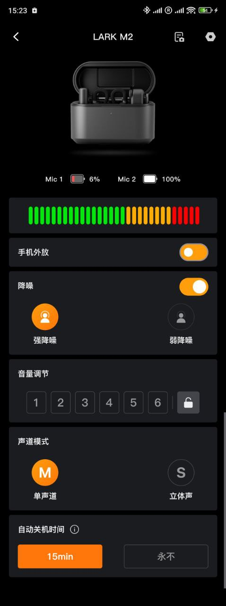

# LARK-M2-UI-android-demo

July 2025

An Android companion application for the LARK M2 wireless microphone. The UI features battery monitoring, detailed audio level visualization, noise cancellation controls, volume adjustment, and configuration for mono/stereo channel modes and auto-shutdown timers.

